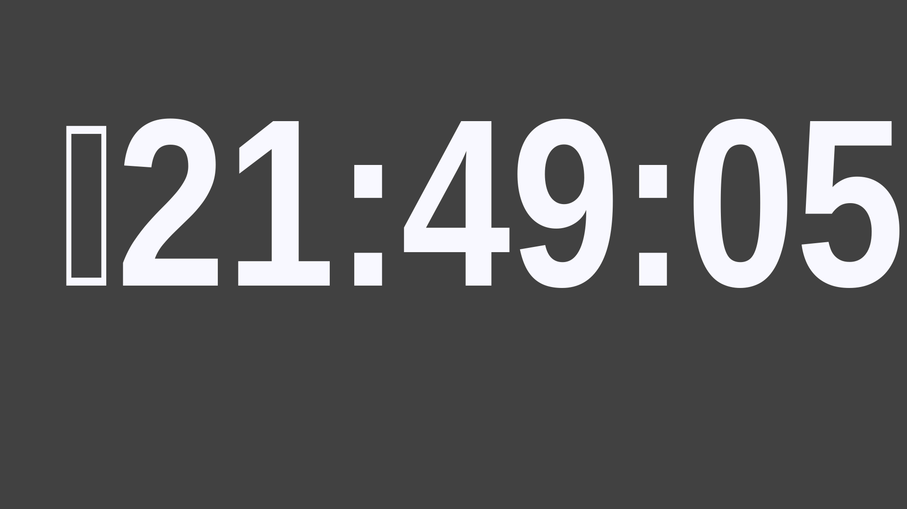

# Full Screen Digital Clock for Raspberry Pi

Using `raspi-config`
Set to run X not Wayland (not sure if this is needed)
Set autologin for your account

Install x11-apps to get `xclock` and `unclutter` to remove cursor when screen is inactive

```sh
apt-get install unclutter x11-apps
```
Download and install a font of your choice. You need something tall and skinny look for "Narrow" or "Condensed" variants. Get a list of installed fonts using `fc-list`

I chose to install Archivo [https://fonts.google.com/specimen/Archivo](https://fonts.google.com/specimen/Archivo)

Add extra fonts to `~/.fonts` and run fc-cache -f to update.

Create a script to run `xclock`

```sh
echo Boot `date` >> /tmp/runxclock.log

/usr/bin/unclutter -display :0 -noevents -grab &

/usr/bin/xclock -digital -strftime '%H:%M:%S'  -update 1 -fg '#F8F8FF' \
-bg '#414141' -geometry '1920x1080' \
-face 'Archivo Narrow:style=SemiBold:size=420' -padding 40
```
Adjust the background (-bg) and foreground (-fg) colours using colour names or #RGB codes. Here is a list of X11 colours [https://en.wikipedia.org/wiki/X11_color_names](https://en.wikipedia.org/wiki/X11_color_names)

Set the screen geometry to match your monitor

Modify your standard Pi desktop to hide the toolbar and autostart xclock at boot

```sh
# in .config/lxsession/LXDE-pi/autostart
# this left the terminal on top of xclock
# @lxterminal -e /home/ja/pi-xclock/runxclock.sh

# this
/home/ja/pi-xclock/runxclock.sh
```

## Run xlock from an SSH terminal
To run `xclock` over SSH use the following command

You can edit Xresources using the -xrm arguments

```sh
DISPLAY=:0 xclock -digital -strftime '%H:%M:%S'  -update 1 \
-fg '#F8F8FF' -bg '#414141' -xrm 'xclock*width:1920' -xrm 'xclock*height:1080' \
-face 'Liberation Sans Narrow:size=380:style=Bold' -xrm 'xclock*padding:130' \
-twentyfour
```

## Pro's
- Very light resource usage

## Con's
- I found it impossible to get the time vertically centred so if this is important you need another solution. I tried using `editres` and tweaking XResource settings but just couldn't get it exactly right.
- `%n` the `strftime` new-line doesn't work


## Screenshots

This is an example screenshot (I took them on the Pi logged in via SSH using `DISPLAY=:0 scrot`

The font used here is Archivo Narrow


This is an example with Liberation Sans Narrow font and trying to embed a newline using strftime `%n%H:%M:%S`


### Version of Pi
```
cat /etc/debian_version
12.6

lsb_release -a
No LSB modules are available.
Distributor ID: Raspbian
Description:    Raspbian GNU/Linux 12 (bookworm)
Release:        12
Codename:       bookworm
```


